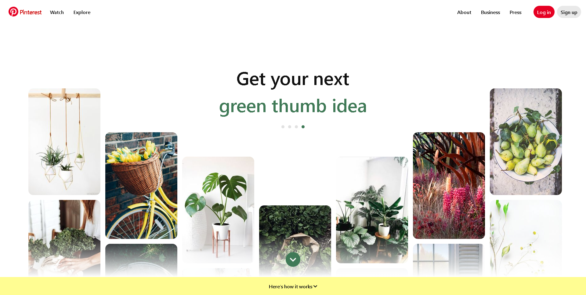

# First Exercises question ( 1 )

1. I choose an online platform that I find visually appealing and has a layout that I would like to replicate is about pinterest:
   
   Main website page 
   

   I tied and my result was :
   

# New Skills or Knowledge Acquired:
Through this assignment, I gained a deeper understanding of Figma and its various tools, particularly in terms of layout creation, component design, and how to structure layers efficiently. One of the most valuable skills I acquired was the use of auto-layout in Figma. This helped me maintain consistent spacing between elements, making the design responsive and easy to adjust when necessary. Additionally, I learned more about the importance of using grids and guides to ensure precise alignment, which directly contributed to a clean, professional layout.

Another key takeaway was understanding the design principles that underpin user interface (UI) design. This includes aspects like hierarchy, typography, color theory, and how to maintain consistency across the design. By replicating an existing page, I was able to observe how these principles are applied in real-world designs, which gave me a clearer perspective on how to enhance the usability and aesthetic appeal of digital products.

# Challenges Faced and How They Were Overcome:
One of the primary challenges I faced was replicating certain interactive elements like hover states or dropdown menus. Since Figma is more of a static design tool, I had to think creatively about how to visually represent these interactive components without being able to demonstrate their functionality directly. To overcome this, I used annotations and overlays to simulate these elements and ensure that my design was clear and comprehensive.

Another challenge was ensuring pixel-perfect accuracy in the replication of the original page. Since the exact dimensions, padding, and margin details weren’t always visible in the source design, I had to use estimation combined with visual judgment to recreate the layout. In some cases, I used browser developer tools to inspect the page’s structure and better understand its design elements, which greatly improved my accuracy.

Overall, this assignment was a rewarding learning experience. Not only did it help solidify my understanding of Figma’s capabilities, but it also reinforced the importance of design fundamentals in creating effective user interfaces. The challenges I encountered pushed me to think critically and come up with practical solutions, and as a result, I feel more confident in my ability to approach similar design tasks in the future.