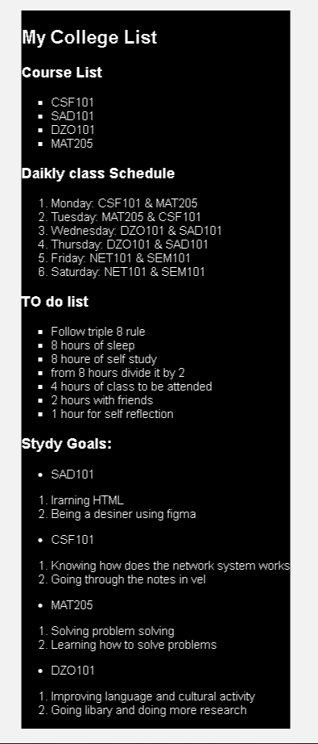

# UNIT 3 - HTML
3.7. Exercises

## 1. List

Create an HTML page with the following components:

<ul>
<li>An unordered list of your courses for the semester.</li>

<li>
An ordered list of your daily class schedule (Monday to Friday).
</li>

<li>
An unordered list of your to-do items for the week (at least 7 items).</li>

<li>
A nested list showing your study goals:
</li>

<li>
Main topics (unordered list)
Subtopics for each main topic (ordered lists)
</li>
</ul>

# Output result:
