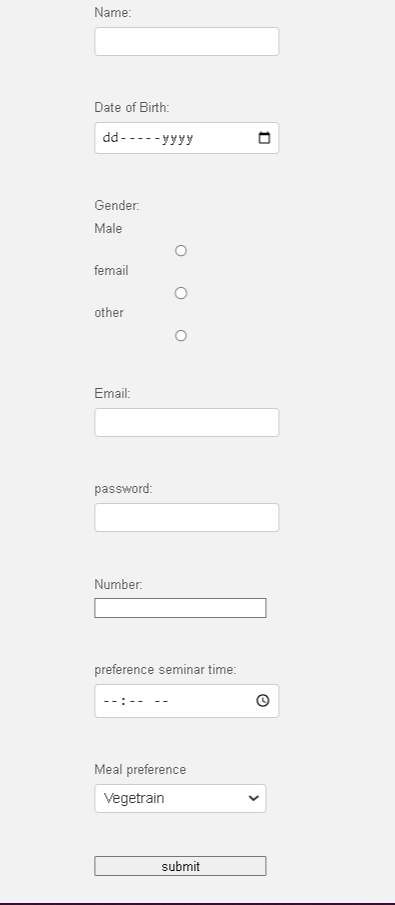

# 2. Form
Create an HTML form for a college seminar registration. The form should include the following input fields:

<ul>
<Li>Full Name</li>
<Li>Date of Birth</li>
<Li>Gender (Male, Female, Other)</li>
<Li>Email Address</li>
<Li>Password</li>
<Li>Phone Number</li>
<Li>Preferred Seminar Time</li>
<Li>Meal Preference</li> (Vegetarian, Non-Vegetarian, Vegan)</li>
<Li>Submit button</li>
</ul>

 # My progress outcome  :
